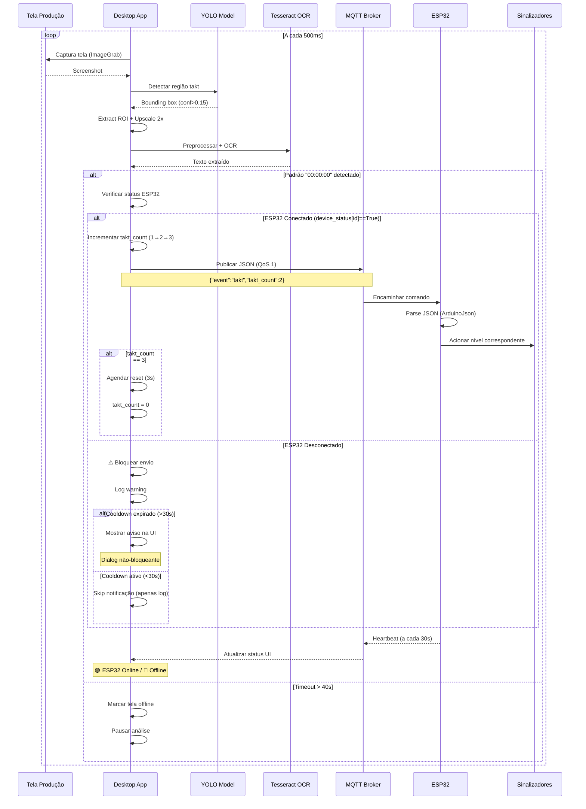

# Takt-Time Process Tracker

Sistema distribuído para monitoramento de linha de produção baseado em **Takt-Time**, utilizando visão computacional e comunicação MQTT para sinalização física em tempo real.

## Índice

- [Visão Geral](#-visão-geral)
- [Arquitetura do Sistema](#-arquitetura-do-sistema)
- [Fluxo de Dados](#-fluxo-de-dados)
- [Componentes](#-componentes)
- [Instalação](#-instalação)
- [Configuração](#-configuração)
- [Uso](#-uso)
- [Tecnologias](#-tecnologias)

## Visão Geral

O sistema detecta automaticamente eventos de **Takt-Time** (padrão `00:00:00`) em telas de produção usando:

1. **Captura de Tela** → Detecção YOLO → OCR Tesseract
2. **Comunicação MQTT** → Envio de comandos para dispositivos
3. **ESP32** → Sinalização física (LEDs progressivos)

### Casos de Uso

- Monitoramento de linhas de produção
- Sinalização visual de metas de takt-time
- Rastreamento de ciclos de produção
- Alertas em tempo real para operadores

## Arquitetura do Sistema

```mermaid
graph TB
    subgraph "Desktop Application"
        UI[PyQt5 Interface]
        YOLO[YOLO Detector]
        OCR[Tesseract OCR]
        MQTT_PY[MQTT Client Python]
    end
    
    subgraph "MQTT Broker"
        BROKER[RabbitMQ/Mosquitto]
    end
    
    subgraph "ESP32 Device"
        MQTT_ESP[MQTT Client ESP32]
        CTRL[Signalizer Controller]
        LED1[LED 1 - Nível 1]
        LED2[LED 2 - Nível 2]
        LED3[LED 3 - Nível 3]
        BUZZ[Buzzer]
    end
    
    UI --> YOLO
    YOLO --> OCR
    OCR --> MQTT_PY
    MQTT_PY -->|takt/device/{id}| BROKER
    BROKER -->|Commands| MQTT_ESP
    MQTT_ESP --> CTRL
    CTRL --> LED1
    CTRL --> LED2
    CTRL --> LED3
    CTRL --> BUZZ
    MQTT_ESP -->|heartbeat/status| BROKER
    BROKER -->|Telemetry| MQTT_PY
```

## Fluxo de Dados

### Fluxo Completo de Detecção



### Topologia MQTT

```mermaid
graph LR
    subgraph "Tópicos MQTT"
        CMD[takt/device/{id}]
        STATUS[takt/device/{id}/status]
        HEART[takt/device/{id}/heartbeat]
    end
    
    PY[Python App] -->|Publish Commands| CMD
    CMD -->|Subscribe| ESP[ESP32]
    
    ESP -->|LWT: offline| STATUS
    ESP -->|Publish: online| STATUS
    STATUS -->|Subscribe| PY
    
    ESP -->|Publish Telemetry| HEART
    HEART -->|Subscribe| PY
```

## Componentes

### 1. Aplicação Desktop (Python)

**Arquitetura Multi-Thread:**

```
┌─────────────────┐
│   Main Thread   │  ← Interface PyQt5
└────────┬────────┘
         │
    ┌────┴─────┬──────────────────┐
    │          │                  │
┌───▼──────┐ ┌─▼──────────────┐ ┌─▼─────────────┐
│ Init     │ │ AsyncWorker    │ │ Timer Thread  │
│ Worker   │ │ (Event Loop)   │ │ (Status Check)│
└──────────┘ └────────────────┘ └───────────────┘
```

**Pipeline de Detecção:**

```python
ImageGrab.grab() 
    ↓
YOLO Detection (conf=0.15)
    ↓
extract_roi() → Padding + Upscaling 2x
    ↓
preprocess_for_ocr() → Grayscale + Bilateral + Otsu
    ↓
Tesseract OCR (whitelist=0-9:A-Z)
    ↓
Pattern Matching: "00:00:00"
```

**Otimizações Implementadas:**

- **Bilateral Filter**: Reduz ruído preservando bordas
- **Otsu Threshold**: Binarização adaptativa automática
- **Upscaling 2x**: Melhora legibilidade de textos pequenos
- **Confidence 0.15**: Detecta até regiões com baixa certeza
- **Debounce 2s**: Evita mensagens MQTT duplicadas
- **Verificação ESP32**: Checa conexão antes de enviar (economiza banda)
- **Cooldown de Avisos**: 30s entre notificações (previne spam de dialogs)

### 2. Sistema MQTT

**Mensagem de Comando Padrão (JSON):**

```json
{
  "event": "takt",
  "message": "Takt detectado",
  "id": "cost-{factory}-{cell}",
  "timestamp": "2025-11-04 14:32:15",
  "takt_count": etapa -> [0,1,2,3]
}
```

**Mensagem de Reset Manual (JSON):**

Mensagem enviada quando botão de reset é apertado

```json
{
  "event": "takt",
  "message": "message",
  "id": "cost-{factory}-{cell}",
  "timestamp": "2025-11-07T14:32:18.123456",
  "takt_count": 0
}
```

**Heartbeat ESP32 (Telemetria):**

```json
{
  "device_id": "TAKT_DEVICE-cost-2-2408-abc123",
  "timestamp": 123456,
  "uptime": 3600,
  "wifi_rssi": -65,
  "free_heap": 245760
}
```

**Last Will Testament (LWT):**
- Broker publica `"offline"` automaticamente se ESP32 desconectar
- Python monitora e atualiza UI (🔴 ESP32: Desconectado)

### 3. ESP32 Embarcado

**Processamento de Comandos:**

```cpp
void processarComando(int comando) {
    NivelSinalizacao nivel = static_cast<NivelSinalizacao>(comando);
    
    switch (nivel) {
        case NIVEL_1: // takt_count == 1
            sinalizadorController.setNivel(NIVEL_1);
            break;
        case NIVEL_2: // takt_count == 2
            sinalizadorController.setNivel(NIVEL_2);
            break;
        case NIVEL_3: // takt_count == 3
            sinalizadorController.setNivel(NIVEL_3);
            break;
    }
}
```

**Recursos:**
- Reconexão automática (5s retry)
- Heartbeat a cada 30s
- Buffer MQTT 512 bytes
- Parsing JSON automático

## Instalação

### Requisitos

- **Python**: 3.8+
- **Tesseract OCR**: 5.x
- **PlatformIO**: Para ESP32 (opcional)

### Opção 1: Executável Compilado (Recomendado)

Para usuários finais que não precisam modificar o código:

1. **Baixar o executável** do release mais recente
2. **Extrair o arquivo** `takttime-tracker-linux.tar.gz`:
   ```bash
   tar -xzf takttime-tracker-linux.tar.gz
   cd takttime-tracker/
   ```
3. **Instalar Tesseract OCR** (dependência do sistema):
   ```bash
   # Ubuntu/Debian
   sudo apt install tesseract-ocr tesseract-ocr-por -y
   ```
4. **Executar**:
   ```bash
   ./takttime-tracker
   ```

### Opção 2: Executar do Código Fonte

Para desenvolvedores ou personalização:

### Windows

1. **Instalar Tesseract OCR**
   - Download: [Tesseract Windows](https://github.com/UB-Mannheim/tesseract/wiki)
   - Adicionar ao PATH: `C:\Program Files\Tesseract-OCR`

2. **Instalar dependências Python**
   ```bash
   pip install -r requirements-app.txt
   ```

3. **Executar aplicação**
   ```bash
   python app.py
   ```

### Linux

1. **Instalar Tesseract OCR**
   ```bash
   # Ubuntu/Debian
   sudo apt update
   sudo apt install tesseract-ocr tesseract-ocr-por -y
   
   # Arch Linux
   sudo pacman -S tesseract tesseract-data-por
   ```

2. **Instalar dependências Python**
   ```bash
   pip install -r requirements-app.txt
   ```

3. **Executar aplicação**
   ```bash
   python app.py
   ```

### Opção 3: Compilar o Executável

Para criar um executável autônomo:

1. **Instalar dependências** (inclui PyInstaller):

   ```bash
   pip install -r requirements.txt
   ```

2. **Executar o script de build**:

   ```bash
   ./build.sh
   ```

3. **O executável estará em** `dist/takttime-tracker/`

📖 Para instruções detalhadas de compilação, consulte [BUILD_INSTRUCTIONS.md](BUILD_INSTRUCTIONS.md)

### ESP32 (PlatformIO)

```bash
cd /path/to/takt-time-receptor
pio run --target upload
pio device monitor
```

## Configuração

### Arquivo `config/config.json`

```json
{
    "device": {
        "cell_number": "2408",
        "factory": "2",
        "cell_leader": "João Silva"
    },
    "network": {
        "wifi_ssid": "DASS-CORP",
        "wifi_pass": "********"
    },
    "tech": {
        "mqtt_host": "10.110.21.3",
        "mqtt_user": "dass",
        "mqtt_pass": "********",
        "model_path": "./train_2025.pt"
    }
}
```

### Interface de Configuração

1. Clicar em **"Configurar"** na aplicação
2. **Configurações Básicas**: Acessíveis diretamente
3. **Configurações Técnicas**: Requer autenticação
   - Usuário: `admin`
   - Senha: `dass@2025`

### Configuração ESP32

Editar `src/main.cpp`:

```cpp
const char *DEVICE_ID = "cost-2-2408";
const char *SSID = "DASS-CORP";
const char *PASSWORD = "sua_senha";
const char *MQTT_SERVER = "10.110.21.3";
```

## Uso

### Iniciar Monitoramento

1. Abrir `app.py`
2. Verificar configurações
3. Clicar em **"▶ Iniciar Análise"**
4. Sistema aguarda detecção de tela takt

### Estados do Sistema

| Estado | Descrição |
|--------|-----------|
| 🟢 **Takt Detectado** | Tela takt visível e sendo analisada |
| 🔴 **Tela Offline** | Timeout >40s sem detecção |
| 🟡 **Aguardando** | Sistema pronto, aguardando tela |
| � **ESP32 Conectado** | Dispositivo respondendo heartbeat |
| 🔴 **ESP32 Desconectado** | Sem heartbeat ou status offline |
| ⚠️ **ESP32 OFF (Takt OK)** | Takt detectado mas mensagem não enviada |

### Comportamento de Proteção

**Sistema de Verificação de Conexão:**

```
Takt Detectado
    ↓
Verificar device_status[ESP32_ID]
    ↓
┌─────────────────────┐
│   ESP32 Conectado?  │
└──────┬──────────┬───┘
       │          │
      SIM        NÃO
       │          │
       ↓          ↓
  Enviar MQTT   Bloquear
  ✅ Sucesso    ⚠️ Skip
       │          │
       └──────────┘
            ↓
    Análise Continua
```

**Sistema de Cooldown de Avisos:**

- **Primeira detecção com ESP32 OFF**: Mostra dialog de aviso
- **Detecções subsequentes < 30s**: Apenas log (silencioso)
- **Após 30 segundos**: Mostra novo aviso se problema persistir
- **Interface permanece responsiva**: Dialogs não-bloqueantes
- **Análise continua rodando**: Não interrompe o monitoramento

### Logs

- **App Desktop**: `logs/app_debug.log` e `logs/main_debug.log`
- **ESP32**: Monitor serial PlatformIO

## Tecnologias

| Componente | Tecnologia | Versão | Propósito |
|------------|-----------|--------|-----------|
| **Desktop** | Python | 3.8+ | Runtime principal |
| | PyQt5 | 5.15+ | Interface gráfica |
| | Ultralytics YOLO | 8.x | Detecção de objetos |
| | Tesseract OCR | 5.x | Reconhecimento de texto |
| | OpenCV | 4.x | Processamento de imagem |
| | paho-mqtt | 1.6+ | Cliente MQTT Python |
| **Embarcado** | ESP32 | - | Microcontrolador |
| | PlatformIO | - | Build system |
| | PubSubClient | 2.8+ | Cliente MQTT Arduino |
| | ArduinoJson | 6.x | Parser JSON embarcado |
| **Infraestrutura** | RabbitMQ/Mosquitto | 3.x | Broker MQTT |

## Performance

- **Detecção**: ~500ms por frame (depende da GPU)
- **Heartbeat ESP32**: 30s (reduz overhead de rede)
- **Debounce MQTT**: 2s (evita spam de comandos)
- **Cooldown de Avisos**: 30s (previne dialogs repetitivos)
- **Buffer MQTT**: 512 bytes (suficiente para JSON)
- **Timeout takt**: 40s (balanceado para falsos negativos)
- **Verificação ESP32**: Tempo real via device_status (sem overhead)
- **QoS Comandos**: 1 (at least once - garantia de entrega)
- **QoS Heartbeat**: 0 (at most once - telemetria)

## Segurança e Confiabilidade

- Configurações técnicas protegidas por autenticação
- Credenciais MQTT armazenadas em `config.json`
- Comunicação MQTT sem TLS (ambiente interno)
- LWT garante detecção de desconexões
- **Verificação de conexão antes de enviar** (economiza banda)
- **Sistema de cooldown** (previne spam de avisos)
- **Reconexão automática** do MQTT em caso de queda
- **Validação de device_status** em tempo real

## Troubleshooting

### Desktop não detecta tela

1. Verificar se YOLO está treinado para sua tela
2. Ajustar confidence threshold em `main.py`
3. Verificar logs: `logs/main_debug.log`

### ESP32 não conecta

1. Verificar credenciais WiFi
2. Testar conectividade: `ping 10.110.21.3`
3. Monitor serial: `pio device monitor`
4. Verificar se heartbeat está sendo enviado (a cada 30s)
5. Checar Last Will Testament (LWT) no broker

### MQTT não comunica

1. Verificar broker rodando: `sudo systemctl status mosquitto`
2. Testar com mosquitto_pub/sub
3. Verificar firewall: porta 1883
4. Checar credenciais no `config.json`

### Mensagens não são enviadas

1. **Verificar status do ESP32 na UI**: 🟢 = Conectado / 🔴 = Desconectado
2. **Logs**: Buscar por `"ESP32 NÃO está conectado"` em `logs/main_debug.log`
3. **Heartbeat**: ESP32 deve enviar heartbeat a cada 30s
4. **device_status**: Verificar se `connection.device_status[id]` está `True`
5. **Last Will Testament**: Confirmar se ESP32 publicou status "online"

### Spam de avisos de ESP32 desconectado

**Problema resolvido na v2.0+**

- Sistema implementa cooldown de 30s entre avisos
- Apenas 1 dialog mostrado a cada 30 segundos
- Logs continuam registrando todas as tentativas
- UI permanece responsiva durante problema

### Timeout de tela aumentado

O timeout padrão foi aumentado de 6s para 40s para:

- Reduzir falsos positivos
- Permitir momentos de transição na tela
- Melhorar estabilidade do sistema
- Evitar interrupções desnecessárias

---

## 📦 Compilando o Aplicativo

### Estrutura do Projeto

```
takttime-process-tracker/
├── app.py                  # Interface gráfica PyQt5
├── main.py                 # Lógica de detecção de takt
├── mqtt_manager.py         # Gerenciador MQTT
├── requirements.txt        # Dependências Python
├── assets/                 # Recursos do projeto
│   ├── train_2025.pt      # Modelo YOLO
│   ├── icon.png           # Ícone do aplicativo
│   └── icon.ico           # Ícone Windows
├── scripts/                # Scripts de build
│   ├── build.sh           # Script de compilação
│   ├── test_build.sh      # Script de teste
│   ├── hook-aio_pika.py   # Hook PyInstaller
│   └── takttime-tracker.spec  # Especificação PyInstaller
├── config/                 # Configurações
└── server/                 # Servidor TypeScript (opcional)
```

### Pré-requisitos para Build

#### Ubuntu/Debian

```bash
sudo apt update
sudo apt install -y tesseract-ocr python3-dev build-essential
```

#### Fedora/RHEL

```bash
sudo dnf install -y tesseract tesseract-langpack-por python3-devel gcc
```

### Dependências Python

```bash
pip install -r requirements.txt
```

O PyInstaller já está incluído nas dependências.

### Compilar o Executável

#### Método Automático (Recomendado)

```bash
cd scripts/
./build.sh
```

O script irá:
1. ✅ Verificar se PyInstaller está instalado
2. ✅ Limpar builds anteriores
3. ✅ Verificar arquivos necessários (modelo, tesseract)
4. ✅ Compilar o aplicativo
5. ✅ Criar README no diretório de distribuição

#### Método Manual

```bash
cd scripts/
# Limpar builds anteriores
rm -rf ../build/ ../dist/

# Compilar com PyInstaller
pyinstaller takttime-tracker.spec --clean
```

### Estrutura de Saída

Após a compilação:

```
dist/takttime-tracker/
├── takttime-tracker          # Executável principal
├── train_2025.pt             # Modelo YOLO
├── config/                   # Configurações
│   └── config.json          # Criado na primeira execução
├── README.txt                # Instruções de uso
└── _internal/                # Bibliotecas Python empacotadas
    ├── PyQt5/
    ├── cv2/
    ├── torch/
    ├── ultralytics/
    └── ...
```

### Executar o Aplicativo Compilado

```bash
cd ../dist/takttime-tracker/
./takttime-tracker
```

### Testar o Build

```bash
cd scripts/
./test_build.sh
```

Este script verifica:
- ✅ Executável criado e com permissões corretas
- ✅ Modelo YOLO presente
- ✅ Diretório de configuração
- ✅ Dependências do sistema (Tesseract, Qt5)

### Distribuir o Aplicativo

#### Criar Pacote Compactado

```bash
cd dist/
tar -czf takttime-tracker-linux-v1.0.tar.gz takttime-tracker/
```

#### O que Incluir na Distribuição

- ✅ Todo o diretório `takttime-tracker/`
- ✅ Instruções de instalação do Tesseract
- ✅ Requisitos de sistema (Linux x86_64)
- ✅ Configuração inicial necessária

### Personalizações

#### Adicionar Ícone Personalizado

1. **Criar/obter ícone** (256x256px PNG recomendado)
2. **Salvar em** `assets/icon.png`
3. **Recompilar** com `./build.sh`

#### Converter PNG para ICO (Windows)

```bash
convert assets/icon.png -define icon:auto-resize=256,128,64,48,32,16 assets/icon.ico
```

#### Recursos de Ícones Gratuitos

- [Flaticon](https://www.flaticon.com/) - Procure por "stopwatch", "production", "timer"
- [Font Awesome](https://fontawesome.com/) - Ícones vetoriais
- [IconFinder](https://www.iconfinder.com/) - Filtro por licença grátis

#### Sugestões de Design

Para aplicativo de monitoramento de takt-time:
- **Cores**: Verde (produção), Amarelo (atenção), Vermelho (alerta)
- **Símbolo**: Cronômetro, engrenagem, linha de produção
- **Estilo**: Moderno, flat design, alta legibilidade

### Problemas Comuns no Build

#### "ModuleNotFoundError" ao executar

**Causa:** Dependência não incluída automaticamente.

**Solução:** Adicione em `scripts/takttime-tracker.spec`:

```python
hiddenimports=[
    # ... existentes ...
    'modulo_faltante',
],
```

#### "FileNotFoundError: train_2025.pt"

**Causa:** Modelo não encontrado.

**Solução:**
- Verifique se `assets/train_2025.pt` existe
- Confirme que está listado em `datas` no `.spec`

#### Aplicativo não inicia

**Causa:** Erro sendo suprimido.

**Solução:** Execute no terminal para ver erros:

```bash
cd dist/takttime-tracker/
./takttime-tracker
```

#### Erro: "libQt5Core.so.5: cannot open shared object file"

**Causa:** Bibliotecas Qt não instaladas.

**Solução:**

```bash
sudo apt install libqt5core5a libqt5gui5 libqt5widgets5
```

#### Build muito grande

**Soluções:**
- Use UPX para compressão (já habilitado)
- Remova dependências não usadas
- Exclua módulos específicos:

```bash
pyinstaller takttime-tracker.spec --exclude-module matplotlib
```

### Tamanho Esperado do Build

- **Executável**: ~500KB
- **Bibliotecas (_internal/)**: ~1.5-2GB (PyTorch, OpenCV)
- **Modelo YOLO**: ~6-50MB
- **Total**: ~1.5-2.5GB

### Compatibilidade

O executável é específico para:
- **OS**: Linux
- **Arquitetura**: x86_64 (AMD64)
- **Distribuição**: Maioria das distribuições modernas

Para outros sistemas:
- **Windows**: Compile no Windows
- **macOS**: Compile no macOS

### Otimizações

#### Reduzir Tamanho

```bash
# Excluir módulos não usados
pyinstaller takttime-tracker.spec --exclude-module tkinter
```

#### Modo GUI Puro (sem console)

Edite `scripts/takttime-tracker.spec`:

```python
console=False,  # Mude para False
```

**⚠️ Atenção**: Sem console, logs não aparecerão.

---


