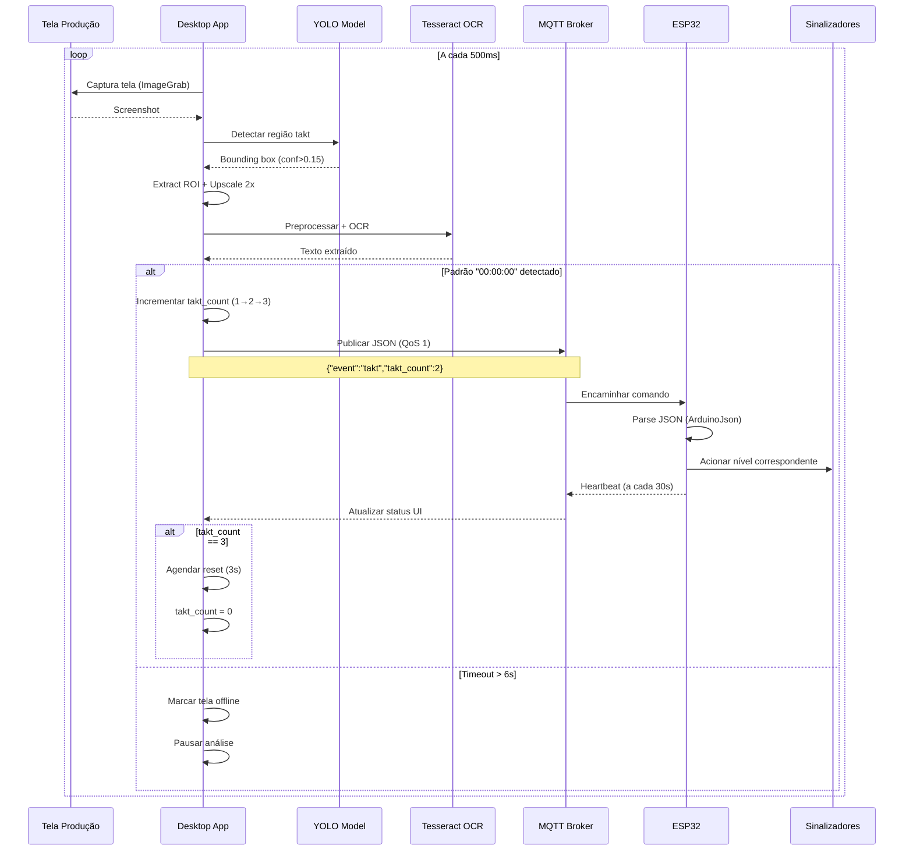

# Takt-Time Process Tracker

Sistema distribuído para monitoramento de linha de produção baseado em **Takt-Time**, utilizando visão computacional e comunicação MQTT para sinalização física em tempo real.

## 📋 Índice

- [Visão Geral](#-visão-geral)
- [Arquitetura do Sistema](#-arquitetura-do-sistema)
- [Fluxo de Dados](#-fluxo-de-dados)
- [Componentes](#-componentes)
- [Instalação](#-instalação)
- [Configuração](#-configuração)
- [Uso](#-uso)
- [Tecnologias](#-tecnologias)

## 🎯 Visão Geral

O sistema detecta automaticamente eventos de **Takt-Time** (padrão `00:00:00`) em telas de produção usando:

1. **Captura de Tela** → Detecção YOLO → OCR Tesseract
2. **Comunicação MQTT** → Envio de comandos para dispositivos
3. **ESP32** → Sinalização física (LEDs progressivos)

### Casos de Uso

- Monitoramento de linhas de produção
- Sinalização visual de metas de takt-time
- Rastreamento de ciclos de produção
- Alertas em tempo real para operadores

## Arquitetura do Sistema

```mermaid
graph TB
    subgraph "Desktop Application"
        UI[PyQt5 Interface]
        YOLO[YOLO Detector]
        OCR[Tesseract OCR]
        MQTT_PY[MQTT Client Python]
    end
    
    subgraph "MQTT Broker"
        BROKER[RabbitMQ/Mosquitto]
    end
    
    subgraph "ESP32 Device"
        MQTT_ESP[MQTT Client ESP32]
        CTRL[Signalizer Controller]
        LED1[LED 1 - Nível 1]
        LED2[LED 2 - Nível 2]
        LED3[LED 3 - Nível 3]
        BUZZ[Buzzer]
    end
    
    UI --> YOLO
    YOLO --> OCR
    OCR --> MQTT_PY
    MQTT_PY -->|takt/device/{id}| BROKER
    BROKER -->|Commands| MQTT_ESP
    MQTT_ESP --> CTRL
    CTRL --> LED1
    CTRL --> LED2
    CTRL --> LED3
    CTRL --> BUZZ
    MQTT_ESP -->|heartbeat/status| BROKER
    BROKER -->|Telemetry| MQTT_PY
```

## 🔄 Fluxo de Dados

### Fluxo Completo de Detecção



### Topologia MQTT

```mermaid
graph LR
    subgraph "Tópicos MQTT"
        CMD[takt/device/{id}]
        STATUS[takt/device/{id}/status]
        HEART[takt/device/{id}/heartbeat]
    end
    
    PY[Python App] -->|Publish Commands| CMD
    CMD -->|Subscribe| ESP[ESP32]
    
    ESP -->|LWT: offline| STATUS
    ESP -->|Publish: online| STATUS
    STATUS -->|Subscribe| PY
    
    ESP -->|Publish Telemetry| HEART
    HEART -->|Subscribe| PY
```

## Componentes

### 1. Aplicação Desktop (Python)

**Arquitetura Multi-Thread:**

```
┌─────────────────┐
│   Main Thread   │  ← Interface PyQt5
└────────┬────────┘
         │
    ┌────┴─────┬──────────────────┐
    │          │                  │
┌───▼──────┐ ┌─▼──────────────┐ ┌─▼─────────────┐
│ Init     │ │ AsyncWorker    │ │ Timer Thread  │
│ Worker   │ │ (Event Loop)   │ │ (Status Check)│
└──────────┘ └────────────────┘ └───────────────┘
```

**Pipeline de Detecção:**

```python
ImageGrab.grab() 
    ↓
YOLO Detection (conf=0.15)
    ↓
extract_roi() → Padding + Upscaling 2x
    ↓
preprocess_for_ocr() → Grayscale + Bilateral + Otsu
    ↓
Tesseract OCR (whitelist=0-9:A-Z)
    ↓
Pattern Matching: "00:00:00"
```

**Otimizações Implementadas:**
- **Bilateral Filter**: Reduz ruído preservando bordas
- **Otsu Threshold**: Binarização adaptativa automática
- **Upscaling 2x**: Melhora legibilidade de textos pequenos
- **Confidence 0.15**: Detecta até regiões com baixa certeza
- **Debounce 2s**: Evita mensagens MQTT duplicadas

### 2. Sistema MQTT

**Mensagem de Comando (JSON):**

```json
{
  "event": "takt",
  "message": "Takt detectado",
  "id": "cost-2-2408",
  "timestamp": "2025-11-04 14:32:15",
  "takt_count": 2
}
```

**Heartbeat ESP32 (Telemetria):**

```json
{
  "device_id": "TAKT_DEVICE-cost-2-2408-abc123",
  "timestamp": 123456,
  "uptime": 3600,
  "wifi_rssi": -65,
  "free_heap": 245760
}
```

**Last Will Testament (LWT):**
- Broker publica `"offline"` automaticamente se ESP32 desconectar
- Python monitora e atualiza UI (🔴 ESP32: Desconectado)

### 3. ESP32 Embarcado

**Processamento de Comandos:**

```cpp
void processarComando(int comando) {
    NivelSinalizacao nivel = static_cast<NivelSinalizacao>(comando);
    
    switch (nivel) {
        case NIVEL_1: // takt_count == 1
            sinalizadorController.setNivel(NIVEL_1);
            break;
        case NIVEL_2: // takt_count == 2
            sinalizadorController.setNivel(NIVEL_2);
            break;
        case NIVEL_3: // takt_count == 3
            sinalizadorController.setNivel(NIVEL_3);
            break;
    }
}
```

**Recursos:**
- Reconexão automática (5s retry)
- Heartbeat a cada 30s
- Buffer MQTT 512 bytes
- Parsing JSON automático

## Instalação

### Requisitos

- **Python**: 3.8+
- **Tesseract OCR**: 5.x
- **PlatformIO**: Para ESP32 (opcional)

### Windows

1. **Instalar Tesseract OCR**
   - Download: [Tesseract Windows](https://github.com/UB-Mannheim/tesseract/wiki)
   - Adicionar ao PATH: `C:\Program Files\Tesseract-OCR`

2. **Instalar dependências Python**
   ```bash
   pip install -r requirements-app.txt
   ```

3. **Executar aplicação**
   ```bash
   python app.py
   ```

### Linux

1. **Instalar Tesseract OCR**
   ```bash
   # Ubuntu/Debian
   sudo apt update
   sudo apt install tesseract-ocr tesseract-ocr-por -y
   
   # Arch Linux
   sudo pacman -S tesseract tesseract-data-por
   ```

2. **Instalar dependências Python**
   ```bash
   pip install -r requirements-app.txt
   ```

3. **Executar aplicação**
   ```bash
   python app.py
   ```

### ESP32 (PlatformIO)

```bash
cd /path/to/takt-time-receptor
pio run --target upload
pio device monitor
```

## Configuração

### Arquivo `config/config.json`

```json
{
    "device": {
        "cell_number": "2408",
        "factory": "2",
        "cell_leader": "João Silva"
    },
    "network": {
        "wifi_ssid": "DASS-CORP",
        "wifi_pass": "********"
    },
    "tech": {
        "mqtt_host": "10.110.21.3",
        "mqtt_user": "dass",
        "mqtt_pass": "********",
        "model_path": "./train_2025.pt"
    }
}
```

### Interface de Configuração

1. Clicar em **"Configurar"** na aplicação
2. **Configurações Básicas**: Acessíveis diretamente
3. **Configurações Técnicas**: Requer autenticação
   - Usuário: `admin`
   - Senha: `dass@2025`

### Configuração ESP32

Editar `src/main.cpp`:

```cpp
const char *DEVICE_ID = "cost-2-2408";
const char *SSID = "DASS-CORP";
const char *PASSWORD = "sua_senha";
const char *MQTT_SERVER = "10.110.21.3";
```

## Uso

### Iniciar Monitoramento

1. Abrir `app.py`
2. Verificar configurações
3. Clicar em **"▶ Iniciar Análise"**
4. Sistema aguarda detecção de tela takt

### Estados do Sistema

| Estado | Descrição |
|--------|-----------|
| 🟢 **Takt Detectado** | Tela takt visível e sendo analisada |
| 🔴 **Tela Offline** | Timeout >6s sem detecção |
| 🟡 **Aguardando** | Sistema pronto, aguardando tela |
| 🔌 **ESP32 Conectado** | Dispositivo respondendo heartbeat |
| 🔴 **ESP32 Desconectado** | Sem heartbeat ou status offline |

### Logs

- **App Desktop**: `app_debug.log` e `main_debug.log`
- **ESP32**: Monitor serial PlatformIO

## Tecnologias

| Componente | Tecnologia | Versão | Propósito |
|------------|-----------|--------|-----------|
| **Desktop** | Python | 3.8+ | Runtime principal |
| | PyQt5 | 5.15+ | Interface gráfica |
| | Ultralytics YOLO | 8.x | Detecção de objetos |
| | Tesseract OCR | 5.x | Reconhecimento de texto |
| | OpenCV | 4.x | Processamento de imagem |
| | paho-mqtt | 1.6+ | Cliente MQTT Python |
| **Embarcado** | ESP32 | - | Microcontrolador |
| | PlatformIO | - | Build system |
| | PubSubClient | 2.8+ | Cliente MQTT Arduino |
| | ArduinoJson | 6.x | Parser JSON embarcado |
| **Infraestrutura** | RabbitMQ/Mosquitto | 3.x | Broker MQTT |

## Performance

- **Detecção**: ~500ms por frame (depende da GPU)
- **Heartbeat ESP32**: 30s (reduz overhead de rede)
- **Debounce MQTT**: 2s (evita spam)
- **Buffer MQTT**: 512 bytes (suficiente para JSON)
- **Timeout takt**: 6s (balanceado para falsos negativos)
- **QoS Comandos**: 1 (at least once)
- **QoS Heartbeat**: 0 (at most once)

## Segurança

- Configurações técnicas protegidas por autenticação
- Credenciais MQTT armazenadas em `config.json`
- Comunicação MQTT sem TLS (ambiente interno)
- LWT garante detecção de desconexões

## Troubleshooting

### Desktop não detecta tela

1. Verificar se YOLO está treinado para sua tela
2. Ajustar confidence threshold em `main.py`
3. Verificar logs: `main_debug.log`

### ESP32 não conecta

1. Verificar credenciais WiFi
2. Testar conectividade: `ping 10.110.21.3`
3. Monitor serial: `pio device monitor`

### MQTT não comunica

1. Verificar broker rodando: `sudo systemctl status mosquitto`
2. Testar com mosquitto_pub/sub
3. Verificar firewall: porta 1883

