# Takt-Time Process Tracker

Sistema distribuído para monitoramento de linha de produção baseado em **Takt-Time**, utilizando visão computacional e comunicação MQTT para sinalização física em tempo real.

## Índice

- [Visão Geral](#-visão-geral)
- [Arquitetura do Sistema](#-arquitetura-do-sistema)
- [Fluxo de Dados](#-fluxo-de-dados)
- [Componentes](#-componentes)
- [Instalação](#-instalação)
- [Configuração](#-configuração)
- [Uso](#-uso)
- [Tecnologias](#-tecnologias)

## Visão Geral

O sistema detecta automaticamente eventos de **Takt-Time** (padrão `00:00:00`) em telas de produção usando:

1. **Captura de Tela** → Detecção YOLO → OCR Tesseract
2. **Comunicação MQTT** → Envio de comandos para dispositivos
3. **ESP32** → Sinalização física (LEDs progressivos)

### Casos de Uso

- Monitoramento de linhas de produção
- Sinalização visual de metas de takt-time
- Rastreamento de ciclos de produção
- Alertas em tempo real para operadores

## Arquitetura do Sistema

```mermaid
graph TB
    subgraph "Desktop Application"
        UI[PyQt5 Interface]
        YOLO[YOLO Detector]
        OCR[Tesseract OCR]
        MQTT_PY[MQTT Client Python]
    end
    
    subgraph "MQTT Broker"
        BROKER[RabbitMQ/Mosquitto]
    end
    
    subgraph "ESP32 Device"
        MQTT_ESP[MQTT Client ESP32]
        CTRL[Signalizer Controller]
        LED1[LED 1 - Nível 1]
        LED2[LED 2 - Nível 2]
        LED3[LED 3 - Nível 3]
        BUZZ[Buzzer]
    end
    
    UI --> YOLO
    YOLO --> OCR
    OCR --> MQTT_PY
    MQTT_PY -->|takt/device/{id}| BROKER
    BROKER -->|Commands| MQTT_ESP
    MQTT_ESP --> CTRL
    CTRL --> LED1
    CTRL --> LED2
    CTRL --> LED3
    CTRL --> BUZZ
    MQTT_ESP -->|heartbeat/status| BROKER
    BROKER -->|Telemetry| MQTT_PY
```

## Fluxo de Dados

### Fluxo Completo de Detecção

```mermaid
sequenceDiagram
    participant Screen as Tela Produção
    participant Desktop as Desktop App
    participant YOLO as YOLO Model
    participant OCR as Tesseract OCR
    participant MQTT as MQTT Broker
    participant ESP32 as ESP32
    participant LEDs as Sinalizadores
    
    loop A cada 500ms
        Desktop->>Screen: Captura tela (ImageGrab)
        Screen-->>Desktop: Screenshot
        Desktop->>YOLO: Detectar região takt
        YOLO-->>Desktop: Bounding box (conf>0.15)
        Desktop->>Desktop: Extract ROI + Upscale 2x
        Desktop->>OCR: Preprocessar + OCR
        OCR-->>Desktop: Texto extraído
        
        alt Padrão "00:00:00" detectado
            Desktop->>Desktop: Verificar status ESP32
            
            alt ESP32 Conectado (device_status[id]==True)
                Desktop->>Desktop: Incrementar takt_count (1→2→3)
                Desktop->>MQTT: Publicar JSON (QoS 1)
                Note over Desktop,MQTT: {"event":"takt","takt_count":2}
                
                MQTT->>ESP32: Encaminhar comando
                ESP32->>ESP32: Parse JSON (ArduinoJson)
                ESP32->>LEDs: Acionar nível correspondente
                
                alt takt_count == 3
                    Desktop->>Desktop: Agendar reset (3s)
                    Desktop->>Desktop: takt_count = 0
                end
            else ESP32 Desconectado
                Desktop->>Desktop: ⚠️ Bloquear envio
                Desktop->>Desktop: Log warning
                
                alt Cooldown expirado (>30s)
                    Desktop->>Desktop: Mostrar aviso na UI
                    Note over Desktop: Dialog não-bloqueante
                else Cooldown ativo (<30s)
                    Desktop->>Desktop: Skip notificação (apenas log)
                end
            end
            
            ESP32-->>MQTT: Heartbeat (a cada 30s)
            MQTT-->>Desktop: Atualizar status UI
            Note over Desktop: 🟢 ESP32 Online / 🔴 Offline
            
        else Timeout > 40s
            Desktop->>Desktop: Marcar tela offline
            Desktop->>Desktop: Pausar análise
        end
    end
```



### Topologia MQTT

```mermaid
graph LR
    subgraph "Tópicos MQTT"
        CMD[takt/device/{id}]
        STATUS[takt/device/{id}/status]
        HEART[takt/device/{id}/heartbeat]
    end
    
    PY[Python App] -->|Publish Commands| CMD
    CMD -->|Subscribe| ESP[ESP32]
    
    ESP -->|LWT: offline| STATUS
    ESP -->|Publish: online| STATUS
    STATUS -->|Subscribe| PY
    
    ESP -->|Publish Telemetry| HEART
    HEART -->|Subscribe| PY
```

## Componentes

### 1. Aplicação Desktop (Python)

**Arquitetura Multi-Thread:**

```
┌─────────────────┐
│   Main Thread   │  ← Interface PyQt5
└────────┬────────┘
         │
    ┌────┴─────┬──────────────────┐
    │          │                  │
┌───▼──────┐ ┌─▼──────────────┐ ┌─▼─────────────┐
│ Init     │ │ AsyncWorker    │ │ Timer Thread  │
│ Worker   │ │ (Event Loop)   │ │ (Status Check)│
└──────────┘ └────────────────┘ └───────────────┘
```

**Pipeline de Detecção:**

```python
ImageGrab.grab() 
    ↓
YOLO Detection (conf=0.15)
    ↓
extract_roi() → Padding + Upscaling 2x
    ↓
preprocess_for_ocr() → Grayscale + Bilateral + Otsu
    ↓
Tesseract OCR (whitelist=0-9:A-Z)
    ↓
Pattern Matching: "00:00:00"
```

**Otimizações Implementadas:**

- **Bilateral Filter**: Reduz ruído preservando bordas
- **Otsu Threshold**: Binarização adaptativa automática
- **Upscaling 2x**: Melhora legibilidade de textos pequenos
- **Confidence 0.15**: Detecta até regiões com baixa certeza
- **Debounce 2s**: Evita mensagens MQTT duplicadas
- **Verificação ESP32**: Checa conexão antes de enviar (economiza banda)
- **Cooldown de Avisos**: 30s entre notificações (previne spam de dialogs)

### 2. Sistema MQTT

**Mensagem de Comando (JSON):**

```json
{
  "event": "takt",
  "message": "Takt detectado",
  "id": "cost-2-2408",
  "timestamp": "2025-11-04 14:32:15",
  "takt_count": 2
}
```

**Heartbeat ESP32 (Telemetria):**

```json
{
  "device_id": "TAKT_DEVICE-cost-2-2408-abc123",
  "timestamp": 123456,
  "uptime": 3600,
  "wifi_rssi": -65,
  "free_heap": 245760
}
```

**Last Will Testament (LWT):**
- Broker publica `"offline"` automaticamente se ESP32 desconectar
- Python monitora e atualiza UI (🔴 ESP32: Desconectado)

### 3. ESP32 Embarcado

**Processamento de Comandos:**

```cpp
void processarComando(int comando) {
    NivelSinalizacao nivel = static_cast<NivelSinalizacao>(comando);
    
    switch (nivel) {
        case NIVEL_1: // takt_count == 1
            sinalizadorController.setNivel(NIVEL_1);
            break;
        case NIVEL_2: // takt_count == 2
            sinalizadorController.setNivel(NIVEL_2);
            break;
        case NIVEL_3: // takt_count == 3
            sinalizadorController.setNivel(NIVEL_3);
            break;
    }
}
```

**Recursos:**
- Reconexão automática (5s retry)
- Heartbeat a cada 30s
- Buffer MQTT 512 bytes
- Parsing JSON automático

## Instalação

### Requisitos

- **Python**: 3.8+
- **Tesseract OCR**: 5.x
- **PlatformIO**: Para ESP32 (opcional)

### Windows

1. **Instalar Tesseract OCR**
   - Download: [Tesseract Windows](https://github.com/UB-Mannheim/tesseract/wiki)
   - Adicionar ao PATH: `C:\Program Files\Tesseract-OCR`

2. **Instalar dependências Python**
   ```bash
   pip install -r requirements-app.txt
   ```

3. **Executar aplicação**
   ```bash
   python app.py
   ```

### Linux

1. **Instalar Tesseract OCR**
   ```bash
   # Ubuntu/Debian
   sudo apt update
   sudo apt install tesseract-ocr tesseract-ocr-por -y
   
   # Arch Linux
   sudo pacman -S tesseract tesseract-data-por
   ```

2. **Instalar dependências Python**
   ```bash
   pip install -r requirements-app.txt
   ```

3. **Executar aplicação**
   ```bash
   python app.py
   ```

### ESP32 (PlatformIO)

```bash
cd /path/to/takt-time-receptor
pio run --target upload
pio device monitor
```

## Configuração

### Arquivo `config/config.json`

```json
{
    "device": {
        "cell_number": "2408",
        "factory": "2",
        "cell_leader": "João Silva"
    },
    "network": {
        "wifi_ssid": "DASS-CORP",
        "wifi_pass": "********"
    },
    "tech": {
        "mqtt_host": "10.110.21.3",
        "mqtt_user": "dass",
        "mqtt_pass": "********",
        "model_path": "./train_2025.pt"
    }
}
```

### Interface de Configuração

1. Clicar em **"Configurar"** na aplicação
2. **Configurações Básicas**: Acessíveis diretamente
3. **Configurações Técnicas**: Requer autenticação
   - Usuário: `admin`
   - Senha: `dass@2025`

### Configuração ESP32

Editar `src/main.cpp`:

```cpp
const char *DEVICE_ID = "cost-2-2408";
const char *SSID = "DASS-CORP";
const char *PASSWORD = "sua_senha";
const char *MQTT_SERVER = "10.110.21.3";
```

## Uso

### Iniciar Monitoramento

1. Abrir `app.py`
2. Verificar configurações
3. Clicar em **"▶ Iniciar Análise"**
4. Sistema aguarda detecção de tela takt

### Estados do Sistema

| Estado | Descrição |
|--------|-----------|
| 🟢 **Takt Detectado** | Tela takt visível e sendo analisada |
| 🔴 **Tela Offline** | Timeout >40s sem detecção |
| 🟡 **Aguardando** | Sistema pronto, aguardando tela |
| � **ESP32 Conectado** | Dispositivo respondendo heartbeat |
| 🔴 **ESP32 Desconectado** | Sem heartbeat ou status offline |
| ⚠️ **ESP32 OFF (Takt OK)** | Takt detectado mas mensagem não enviada |

### Comportamento de Proteção

**Sistema de Verificação de Conexão:**

```
Takt Detectado
    ↓
Verificar device_status[ESP32_ID]
    ↓
┌─────────────────────┐
│   ESP32 Conectado?  │
└──────┬──────────┬───┘
       │          │
      SIM        NÃO
       │          │
       ↓          ↓
  Enviar MQTT   Bloquear
  ✅ Sucesso    ⚠️ Skip
       │          │
       └──────────┘
            ↓
    Análise Continua
```

**Sistema de Cooldown de Avisos:**

- **Primeira detecção com ESP32 OFF**: Mostra dialog de aviso
- **Detecções subsequentes < 30s**: Apenas log (silencioso)
- **Após 30 segundos**: Mostra novo aviso se problema persistir
- **Interface permanece responsiva**: Dialogs não-bloqueantes
- **Análise continua rodando**: Não interrompe o monitoramento

### Logs

- **App Desktop**: `app_debug.log` e `main_debug.log`
- **ESP32**: Monitor serial PlatformIO

## Tecnologias

| Componente | Tecnologia | Versão | Propósito |
|------------|-----------|--------|-----------|
| **Desktop** | Python | 3.8+ | Runtime principal |
| | PyQt5 | 5.15+ | Interface gráfica |
| | Ultralytics YOLO | 8.x | Detecção de objetos |
| | Tesseract OCR | 5.x | Reconhecimento de texto |
| | OpenCV | 4.x | Processamento de imagem |
| | paho-mqtt | 1.6+ | Cliente MQTT Python |
| **Embarcado** | ESP32 | - | Microcontrolador |
| | PlatformIO | - | Build system |
| | PubSubClient | 2.8+ | Cliente MQTT Arduino |
| | ArduinoJson | 6.x | Parser JSON embarcado |
| **Infraestrutura** | RabbitMQ/Mosquitto | 3.x | Broker MQTT |

## Performance

- **Detecção**: ~500ms por frame (depende da GPU)
- **Heartbeat ESP32**: 30s (reduz overhead de rede)
- **Debounce MQTT**: 2s (evita spam de comandos)
- **Cooldown de Avisos**: 30s (previne dialogs repetitivos)
- **Buffer MQTT**: 512 bytes (suficiente para JSON)
- **Timeout takt**: 40s (balanceado para falsos negativos)
- **Verificação ESP32**: Tempo real via device_status (sem overhead)
- **QoS Comandos**: 1 (at least once - garantia de entrega)
- **QoS Heartbeat**: 0 (at most once - telemetria)

## Segurança e Confiabilidade

- Configurações técnicas protegidas por autenticação
- Credenciais MQTT armazenadas em `config.json`
- Comunicação MQTT sem TLS (ambiente interno)
- LWT garante detecção de desconexões
- **Verificação de conexão antes de enviar** (economiza banda)
- **Sistema de cooldown** (previne spam de avisos)
- **Reconexão automática** do MQTT em caso de queda
- **Validação de device_status** em tempo real

## Troubleshooting

### Desktop não detecta tela

1. Verificar se YOLO está treinado para sua tela
2. Ajustar confidence threshold em `main.py`
3. Verificar logs: `main_debug.log`

### ESP32 não conecta

1. Verificar credenciais WiFi
2. Testar conectividade: `ping 10.110.21.3`
3. Monitor serial: `pio device monitor`
4. Verificar se heartbeat está sendo enviado (a cada 30s)
5. Checar Last Will Testament (LWT) no broker

### MQTT não comunica

1. Verificar broker rodando: `sudo systemctl status mosquitto`
2. Testar com mosquitto_pub/sub
3. Verificar firewall: porta 1883
4. Checar credenciais no `config.json`

### Mensagens não são enviadas

1. **Verificar status do ESP32 na UI**: 🟢 = Conectado / 🔴 = Desconectado
2. **Logs**: Buscar por `"ESP32 NÃO está conectado"` em `main_debug.log`
3. **Heartbeat**: ESP32 deve enviar heartbeat a cada 30s
4. **device_status**: Verificar se `connection.device_status[id]` está `True`
5. **Last Will Testament**: Confirmar se ESP32 publicou status "online"

### Spam de avisos de ESP32 desconectado

**Problema resolvido na v2.0+**

- Sistema implementa cooldown de 30s entre avisos
- Apenas 1 dialog mostrado a cada 30 segundos
- Logs continuam registrando todas as tentativas
- UI permanece responsiva durante problema

### Timeout de tela aumentado

O timeout padrão foi aumentado de 6s para 40s para:

- Reduzir falsos positivos
- Permitir momentos de transição na tela
- Melhorar estabilidade do sistema
- Evitar interrupções desnecessárias

